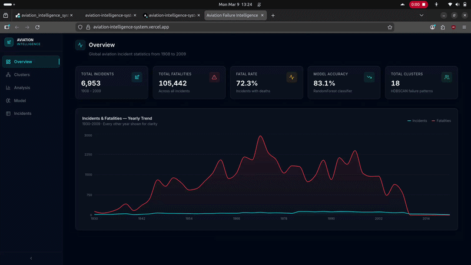

# Aviation Failure Intelligence System

A system for exploring historical aviation incidents and identifying safety
patterns from large accident datasets.

## Project Snapshot

1. Dataset includes more than 6,900 aviation incidents from 1908 to 2020  
2. The system analyzes incident reports to identify trends and recurring failure patterns  
3. Includes semantic clustering, severity prediction, and root cause extraction using LLMs  
4. Built as a full-stack data application combining machine learning and interactive visualization  

**Live Demo:** https://aviation-intelligence-system.vercel.app  
**Backend API:** https://aviation-intelligence-system.onrender.com  

---

## Why This Project Exists

Understanding past incidents is one of the main ways aviation safety improves.
Unfortunately, many historical aviation datasets exist only as spreadsheets
or long textual reports, which makes large scale analysis difficult.

This project explores how modern data tooling and machine learning can turn
historical aviation records into something easier to explore and analyze.
Instead of manually reading thousands of reports, the system processes the data
through a pipeline that surfaces clusters, patterns, and potential root causes.

The goal is to demonstrate how data pipelines, machine learning, and
visualization can work together to extract meaningful insights from raw
incident data.

---

## Key Features

1. Upload aviation incident CSV datasets for automated analysis  
2. Automatic data cleaning, type normalization, and severity labeling  
3. Semantic clustering of incidents using embeddings, UMAP, and HDBSCAN  
4. RandomForest model for predicting severity on unlabeled incidents  
5. LLM-assisted extraction of root cause and contributing factors from reports  
6. Interactive dashboard to explore clusters, trends, and historical data  
7. Filtering by aircraft type, operator, location, severity, and decade  
8. REST API providing access to analysis results  

---

## Key Engineering Highlights

1. Built a full ML processing pipeline  
   upload → clean → embed → cluster → classify → extract → serve  

2. Implemented a two-pass UMAP approach  
   384D → 50D for clustering accuracy  
   384D → 2D for visualization  

3. Used HDBSCAN for unsupervised clustering to detect recurring failure patterns
   directly from narrative descriptions  

4. Trained a RandomForest classifier achieving about **83 percent accuracy**
   to estimate severity for incidents missing labels  

5. Integrated Groq and Google Gemini APIs to extract structured information
   such as root cause, phase of flight, and contributing factors  

6. Built a React dashboard with Recharts visualizations,
   TanStack Query data fetching, and Framer Motion interactions  

7. Containerized the backend with Docker and deployed the system
   using Render for the API and Vercel for the frontend  

---

## System Architecture

```
CSV Upload
     │
     ▼
Data Cleaning and Normalization
(null handling, type casting, severity labeling)
     │
     ▼
Sentence Embeddings
(all-MiniLM-L6-v2, 384 dimensional vectors)
     │
     ▼
UMAP Dimensionality Reduction
(384D → 50D for clustering)
     │
     ▼
HDBSCAN Clustering
(unsupervised failure pattern discovery)
     │
     ▼
UMAP Visualization Reduction
(384D → 2D for scatter visualization)
     │
     ▼
RandomForest Severity Classifier
(train on labeled rows, predict unlabeled)
     │
     ▼
LLM Root Cause Extraction
(Groq / Google Gemini)
     │
     ▼
REST API
(FastAPI with paginated and filterable endpoints)
     │
     ▼
React Dashboard
(Recharts, TanStack Query, Tailwind)
```

---

## Technology Stack

### Backend

- Python 3.12  
- FastAPI  
- SQLAlchemy  
- SQLite  

### Machine Learning

- scikit-learn (RandomForest)  
- HDBSCAN  
- UMAP  
- sentence-transformers (all-MiniLM-L6-v2)  
- XGBoost  
- imbalanced-learn  

### LLM Integration

- Groq API  
- Google Gemini (google-genai)  

### Frontend

- React 18  
- TypeScript  
- Vite  
- Recharts  
- TanStack Query  
- Tailwind CSS  
- Framer Motion  

### Deployment

- Docker  
- Render for backend hosting  
- Vercel for frontend deployment  

---

## Running the Project Locally

Requirements: **Python 3.12 and Node.js 18+**

### Backend

```bash
cd backend
python -m venv venv
source venv/bin/activate       # Windows: venv\Scripts\activate
pip install -r requirements.txt
uvicorn app.main:app --reload --port 10000
```

### Frontend

```bash
cd frontend
npm install
npm run dev
```

Create a file:

```
frontend/.env.local
```

Add:

```
VITE_API_URL=http://localhost:10000
```

---

### Running with Docker

```bash
cd backend
docker build -t aviation-backend .
docker run -p 10000:10000 aviation-backend
```

---

### Running the Pipeline

```bash
# Upload dataset
curl -X POST http://localhost:10000/api/v1/upload \
  -F "file=@your_data.csv"

# Check pipeline status
curl http://localhost:10000/api/v1/pipeline/1/status

# Run clustering
curl -X POST http://localhost:10000/api/v1/clusters/run/1

# Train severity classifier
curl -X POST http://localhost:10000/api/v1/model/train/1

# Run LLM extraction
curl -X POST "http://localhost:10000/api/v1/llm/run/1?extract_limit=200"
```

---

### Backend Environment Variables

```
DATABASE_URL=sqlite:///./data/aviation.db
ALLOWED_ORIGINS=["https://your-frontend-domain.com"]
GROQ_API_KEY=your_key
GOOGLE_API_KEY=your_key
ENVIRONMENT=production
PORT=10000
```

Note:

`ALLOWED_ORIGINS` must be a valid JSON array string.  
Providing a single URL without brackets will cause the server to fail at startup.

---

## Example Insights

The system can highlight patterns such as:

- Failure categories discovered automatically from incident narratives  
- Changes in accident severity across decades as regulations evolved  
- Aircraft types and operators that frequently appear within specific clusters  
- Semantically similar incidents that are categorized differently in the raw data  

These relationships are difficult to see when working with raw tables alone.
Embedding and clustering techniques help surface them automatically.

---

## Future Improvements

1. Integration with live NTSB and ASRS incident feeds  
2. Airline specific safety dashboards for fleet level analysis  
3. Automated anomaly detection when new data shows unusual spikes  
4. Migration to PostgreSQL for multi-user workloads  
5. Mapping causes to ICAO Annex 13 classification categories  

---

## License

MIT License# Aviation Failure Intelligence System

A platform for analyzing historical aviation incidents and identifying safety patterns from large incident datasets.

---

## 1 Project Snapshot

1 Dataset contains more than 6,900 aviation incidents from 1908 to 2020
2 System analyzes incident reports to discover safety trends and failure patterns
3 Includes clustering, severity prediction, and root cause extraction
4 Built as a full stack data system with machine learning and interactive visualization

Live Demo
https://aviation-intelligence-system.vercel.app

Backend API
https://aviation-intelligence-system.onrender.com

---

## 2 Project Preview



Interactive dashboard for exploring aviation incident clusters, severity trends, and historical patterns.

---

## 3 Why This Project Exists

Aviation safety improves when historical incidents are carefully analyzed.
However many aviation datasets exist only as spreadsheets or textual reports, which makes large scale analysis difficult.

This project demonstrates how modern data tools and machine learning can transform historical aviation incident records into a system that makes safety insights easier to discover.

The goal is to show how data pipelines, machine learning, and visualization can work together to turn raw incident data into meaningful insights.

---

## 4 Key Features

1 Upload aviation incident datasets for analysis
2 Automatic data cleaning and normalization
3 Semantic clustering of incidents using sentence embeddings
4 Machine learning based severity prediction
5 Root cause extraction from incident narratives
6 Interactive dashboard for exploring trends and clusters
7 Filtering incidents by aircraft, operator, location, and decade
8 REST API for programmatic access to analysis results

---

## 5 Key Engineering Highlights

1 Built an end to end data analysis pipeline for processing historical aviation incident records

2 Implemented semantic clustering using sentence embeddings, UMAP dimensionality reduction, and HDBSCAN clustering

3 Designed a machine learning pipeline using RandomForest to predict incident severity

4 Integrated language models to extract structured root cause and contributing factors from narrative descriptions

5 Built an interactive React dashboard to visualize trends, clusters, and historical patterns

6 Deployed a full stack system using Docker, Render, and Vercel

---

## 6 System Architecture

```text
Dataset Upload
        │
        ▼
Data Cleaning and Normalization
        │
        ▼
Sentence Embeddings
        │
        ▼
UMAP Dimensionality Reduction
        │
        ▼
HDBSCAN Clustering
        │
        ▼
Severity Classification
        │
        ▼
Root Cause Extraction
        │
        ▼
REST API
        │
        ▼
React Dashboard
```

---

## 7 Technology Stack

Backend
1 Python
2 FastAPI
3 SQLAlchemy
4 SQLite

Machine Learning
1 scikit-learn
2 HDBSCAN
3 UMAP
4 sentence-transformers

Frontend
1 React
2 TypeScript
3 Vite
4 Recharts
5 Tailwind CSS

Deployment
1 Docker
2 Render for backend hosting
3 Vercel for frontend deployment

---

## 8 Project Structure

```text
backend/
    app/
        api/
        models/
        services/
        pipelines/
    requirements.txt

frontend/
    src/
        components/
        pages/
        services/

data/
    aviation_incidents.csv

docs/
    dashboard_demo.gif
```

---

## 9 Running the Project Locally

Requirements

1 Python 3.12
2 Node.js 18 or newer

---

### Backend Setup

```bash
cd backend
python -m venv venv
source venv/bin/activate
pip install -r requirements.txt
uvicorn app.main:app --reload --port 10000
```

---

### Frontend Setup

```bash
cd frontend
npm install
npm run dev
```

Create a file:

```
frontend/.env.local
```

Add:

```
VITE_API_URL=http://localhost:10000
```

---

## 10 Example Insights

The system can identify patterns such as:

1 Common categories of aviation incidents based on narrative descriptions
2 Changes in accident severity across decades
3 Frequently occurring contributing factors
4 Similar incidents grouped through semantic clustering

These insights help reveal patterns that are difficult to identify when working directly with raw datasets.

---

## 11 Future Improvements

1 Integration with real time aviation incident datasets
2 Airline specific safety analysis dashboards
3 Automated anomaly detection for new incidents
4 Migration to PostgreSQL for larger multi user workloads

---

## 12 License

MIT License
